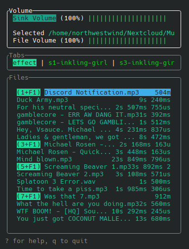

# cls - Command-Line Soundboard
It's just a file manager and command runner.

### Fun fact
"cls" is also a abbreviation of a Cantonese swear, 㾒撚線 (meaning "f*cking crazy"). It was the mental state of a Javascript dev trying to make a soundboard in Rust without prior Rust programming experience.

## Features
- Global Hotkey (also works on Wayland)
- Play any file that `ffmpeg` supports
- Directory tabs

## Usage
As I told you, this is just a file manager and command runner.  
This only works on Linux with a PulseAudio provider. If you want a soundboard for other platforms or providers similar to this, I recommend [Soundux](https://github.com/Soundux/Soundux).

### Dependencies
- `ffmpeg`
- `pulseaudio` / `pipewire-pulse` / anything to provides `pactl` and `pacat`

### Install
If you are using an Arch Linux-based distro, it's already available on the AUR as [`cls-soundboard`](https://aur.archlinux.org/packages/cls-soundboard) (the `cls` package is already taken by a random script).  
For other distros, the binary file is provided in release, or you can build it yourself.

### Building
You'll need `cargo` for this.
```bash
git clone https://github.com/North-West-Wind/cls
cd cls
cargo build --release
```
The binary file will be available as `target/release/cls`

### Setup
This soundboard is a very bare-bones program. It is built to fit my existing streaming configuration, so I'll run you down on how to set it up.

First of all, this program creates a null-sink from PulseAudio that is called `cls`, and all sounds are played into this sink. If you want the sound to be played somewhere, you'll have to load a few modules.

#### To Mic
Redirecting the sink to a source is unreasonably complicated. I wish there was a single module that does it all.

We need to create an input mixer.

```bash
# create another null-sink for mixing mic and cls
pactl load-module module-null-sink sink_name=input_mixer
# redirect cls to the input mixer
pactl load-module module-loopback source=cls.monitor sink=input_mixer latency_msec=10
# redirect mic to the input mixer
pactl load-module module-loopback source=@DEFAULT_SOURCE@ sink=iput_mixer latency_msec=10
# redirect input mixer to an actual source
pactl load-module module-remap-source master=input_mixer.monitor source_name=mic
```

The last step may not be necessary if you intend to use this for the browser, but other applications may not pick up the input mixer monitor as an input.

#### To Speaker
In comparison, redirecting a sink to another sink is much easier.

```bash
# redirect cls to the default speaker
pactl load-module module-loopback source=cls.monitor sink=@DEFAULT_SINK@
```
Or, if you need it in a separated sink (for streaming and recording purposes like me):
```bash
# create a sink that also plays into the speaker
pactl load-module module-remap-sink master=@DEFAULT_SINK@ sink_name=out_sfx
# redirect cls to that sink
pactl load-module module-loopback source=cls.monitor sink=out_sfx
```

### TUI
On the other hand, TUI should be rather intuitive. Press `?` to bring up the help menu for instructions.  


### Hidden
You can also run `cls` without the TUI, so it will only handle global hotkeys.  
```bash
cls --hidden
```
There is currently no indicator to tell you if it is running, so you will have to kill it using another command.
```bash
pkill cls
```

## Motivation
I was using another soundboard - [Soundux](https://github.com/Soundux/Soundux). It was a solid program, until everyone wants to switch to Wayland. Due to Soundux being Electron-based, global hotkeys doesn't work on Wayland.

I would wait for them to add support for that, if it weren't for them going through a major rewrite. From the [progress page](https://github.com/Soundux/Soundux/issues/591), it hasn't been updated for like 2 years. Therefore, I took it as a challenge to write my own soundboard (and also learn Rust).

That's why this soundboard is structured like Soundux, except a bunch of missing features, such as passthrough, which I probably won't implement.