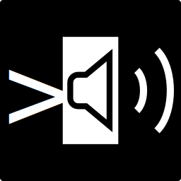

# cls - Command-Line Soundboard
It's just a file manager and command runner.  


***(Hey GitHub people! This repository has been moved to Codeberg and what you are reading is simply a mirror repository. I'm not publishing releases on GitHub anymore because it's annoying to do it on 2 places, so if you are looking for releases, please visit the [Coderberg repository](https://codeberg.org/NorthWestWind/cls))***

### Fun fact
"cls" is also a abbreviation of a Cantonese swear, 痴撚線 (meaning "f*cking crazy"). It was the mental state of a Javascript dev trying to make a soundboard in Rust without prior Rust programming experience.

## Features
- Global Hotkey (also works on Wayland)
- Play any file that `ffmpeg` supports
- Directory tabs
- Waveforms (>=2.0.0)

## Usage
As I told you, this is just a file manager and command runner.  
This only works on Linux with a PulseAudio provider. If you want a soundboard for other platforms or providers similar to this, I recommend [Soundux](https://github.com/Soundux/Soundux).

### Dependencies
- `ffmpeg`
- `pulseaudio` / `pipewire-pulse` / anything to provides `pactl` and `pacat`

### Install
If you are using an Arch Linux-based distro, it's already available on the AUR as [`cls-rs`](https://aur.archlinux.org/packages/cls-rs).  
For other distros, the binary file is provided in release, or you can build it yourself.

### Building
You'll need `cargo` for this.
```bash
git clone https://github.com/North-West-Wind/cls
cd cls
cargo build --release
```
The binary file will be available as `target/release/cls`

### Setup
This soundboard is a very bare-bones program. It is built to fit my existing streaming configuration, so I'll run you down on how to set it up.

First of all, this program creates a null-sink from PulseAudio that is called `cls`, and all sounds are played into this sink. A loopback of the sink is automatically created to the current audio output. There's a good chance you don't (just) want this. To change that, press `c` in the TUI. 

#### Auto Loopback (>=1.2.0)
Starting from v1.2.0, settings have been implemented to automatically load loopback modules. To configure them, simply open the settings menu by pressing `c` in the TUI. On the right, you will see `Loopback 1`, `Loopback 2` and `Loopback Default` (only in >=2.0.0).
- `Loopback 1` and `Loopback 2` will create a loopback to the spcified sinks
	- This can be a monitor to a source
- `Loopback Default` is a boolean variable that determines if the `cls` sink will play to the current audio output

Before v2.0.0, changing these settings requires a reload (exiting and relaunching) of the program.

#### Manual Loopback (<1.2.0)
If you want the sound to be played somewhere, you'll have to load a few modules.

##### To Mic
Redirecting the sink to a source is unreasonably complicated. I wish there was a single module that does it all.

We need to create an input mixer.

```bash
# create another null-sink for mixing mic and cls
pactl load-module module-null-sink sink_name=input_mixer
# redirect cls to the input mixer
pactl load-module module-loopback source=cls.monitor sink=input_mixer latency_msec=10
# redirect mic to the input mixer
pactl load-module module-loopback source=@DEFAULT_SOURCE@ sink=iput_mixer latency_msec=10
# redirect input mixer to an actual source
pactl load-module module-remap-source master=input_mixer.monitor source_name=mic
```

The last step may not be necessary if you intend to use this for the browser, but other applications may not pick up the input mixer monitor as an input.

##### To Speaker
In comparison, redirecting a sink to another sink is much easier.

```bash
# redirect cls to the default speaker
pactl load-module module-loopback source=cls.monitor sink=@DEFAULT_SINK@
```
Or, if you need it in a separated sink (for streaming and recording purposes like me):
```bash
# create a sink that also plays into the speaker
pactl load-module module-remap-sink master=@DEFAULT_SINK@ sink_name=out_sfx
# redirect cls to that sink
pactl load-module module-loopback source=cls.monitor sink=out_sfx
```

### TUI
On the other hand, TUI should be rather intuitive. Press `?` to bring up the help menu for instructions.  


### Hidden & Edit Mode
You can also run `cls` without the TUI, so it will only handle global hotkeys.  
It is basically a read-only mode.  
```bash
cls --hidden
```
There is currently no indicator to tell you if it is running, so you will have to kill it using another command.
```bash
cls exit
```

You can also enter "write-only" mode, where you cannot play any files, but edit configurations.  
```bash
cls --edit # or `cls -e`
```
`cls` is now single-instance, meaning only one `cls` process can play sound files.
If there's already another instance running, `cls` will automatically enter edit mode.

To simplify, first time launching `cls` will be normal, but second time will be forced `--edit`.

If you want to run multiple instance for some reason (e.g. multi-user system), simply set the `TMPDIR` environment variable to something different when launching. See [Socket Control](#Socket_Control) to see how `TMPDIR` is used.

### Socket Control
Starting from v1.1.0, `cls` can communicate using a Unix socket located at `$TMPDIR/cls/cls.sock`.
This allows `cls --hidden` to be controlled without the use of global inputs, and causes `cls` to be single-instance.

The subcommands of `cls` can be used to communicate with this primary instance.  
Here's the current list of subcommands implemented:
- `cls exit`: Terminate the instance
- `cls reload-config`: Reloads the configuration file into memory
- `cls add-tab <dir>`: Adds a new directory tab
- `cls delete-tab [--index <index>] [--path <path>] [--name <name>]`: Deletes a directory tab.
	- If no options are specified, the selected tab is deleted.
	- `--index` will delete the tab at that index (starting from 0).
	- `--path` will delete the tab that matches the full path.
	- `--name` will delete the tab that matches the base name (i.e. the name you see in the `Tabs` block).
- `cls reload-tab [--index <index>] [--path <path>] [--name <name>]`: Reloads a directory tab. Options serve the same functions as in `delete-tab`.
- `cls play <path>`: Plays a file.
- `cls play-id <id>`: Plays a file by its user-defined ID.
- `cls play-wave <id>`: Plays a waveform by its user-defined ID.
- `cls stop`: Stops all the audio files that are playing.
- `cls stop-wave <id>`: Stops a waveform by its user-defined ID.
- `cls set-volume <volume> [--increment] [--path <path>]`: Set the volume for the `cls` sink or a specific file.
	- If `--increment` is **NOT** set, the volume is set to `<volume>` provided.
	- If `--increment` is **SET**, the volume is incremented by `<volume>` (can be negative).
	- If `--path` is provided, volume is set for the file instead of the sink.

## Motivation
I was using another soundboard - [Soundux](https://github.com/Soundux/Soundux). It was a solid program, until everyone wants to switch to Wayland. Due to Soundux being Electron-based, global hotkeys doesn't work on Wayland.

I would wait for them to add support for that, if it weren't for them going through a major rewrite. From the [progress page](https://github.com/Soundux/Soundux/issues/591), it hasn't been updated for like 2 years. Therefore, I took it as a challenge to write my own soundboard (and also learn Rust).

That's why this soundboard is structured like Soundux, except a bunch of missing features, such as passthrough, which I probably won't implement.